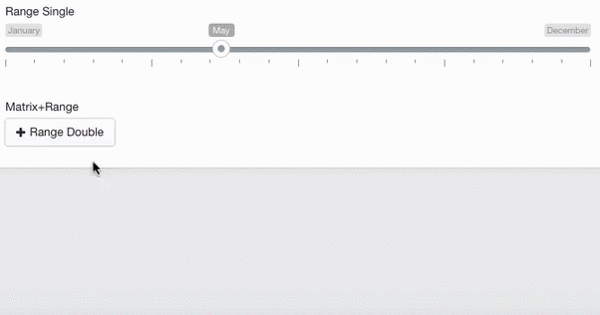

#MX RangeSlider for CraftCMS
MX RangeSlider is range fieldtype for ExpressionEngine 2 which helps you to create a really nice and user friendly range select elements.

##Installation

* Place the randomm folder inside your craft/plugins folder
* Go to settings/plugins and install MX RangeSlider.
* Create field and select a type.

##Field settings
**type**	Optional property, will select slider type from two options: single - for single range slider, or double - for double range slider

**min**	Range minumum

**max**	Range maximum

**from**	Optional property, on default has the same value as min.

**to**	Optional property, on default has the same value as max.

**step**	Optional property, set slider step value

**prefix**	Optional property, set prefix text to all values. For example: "$" will convert "100" in to "$100"

**postfix**	Optional property, set postfix text to all values. For example: " €" will convert "100" in to "100 €"

**maxPostfix**	Optional property, set postfix text to maximum value. For example: maxPostfix - "+" will convert "100" to "100+"

**hasGrid**	Optional property, enables grid at the bottom of the slider (it adds 20px height and this can be customised through CSS)

**gridMargin**	Optional property, enables margin between slider corner and grid

**hideMinMax**	Optional property, disables Min and Max fields.

**hideFromTo**	Optional property, disables From an To fields.

**prettify**	Optional property, allow to separate large numbers with spaces, eg. 10 000 than 10000

**values**	Array of custom values: a, b, c etc.

**theme**  Skin.

##Tags

	    	from {{ entry.range_field.from }}
	    	to {{ entry.range_field.to }}
	    	value {{ entry.range_field.value }}
	    	
	    	from label {{ entry.range_field.from_label }}
	    	to label {{ entry.range_field.to_label }}
	    	value label {{ entry.range_field.value_label }}
	    	
##Support Policy

This is Communite Edition (CE) add-on.

##Contributing To MX RangeSlider CE

Your participation to MX RangeSlider CE development is very welcome!

You may participate in the following ways:

* [Report issues](https://github.com/MaxLazar/mx-rangeslider-craftcms/issues)
* Fix issues, develop features, write/polish documentation
Before you start, please adopt an existing issue (labelled with "ready for adoption") or start a new one to avoid duplicated efforts.
Please submit a merge request after you finish development.

###License

The MX RangeSlider for CraftCMS CE is open-sourced software licensed under the [MIT license](http://opensource.org/licenses/MIT)

###Thanks To
[Denis Ineshin](https://github.com/IonDen) for [ion.rangeSlider](https://github.com/IonDen/ion.rangeSlider) ([MIT license](http://opensource.org/licenses/MIT))